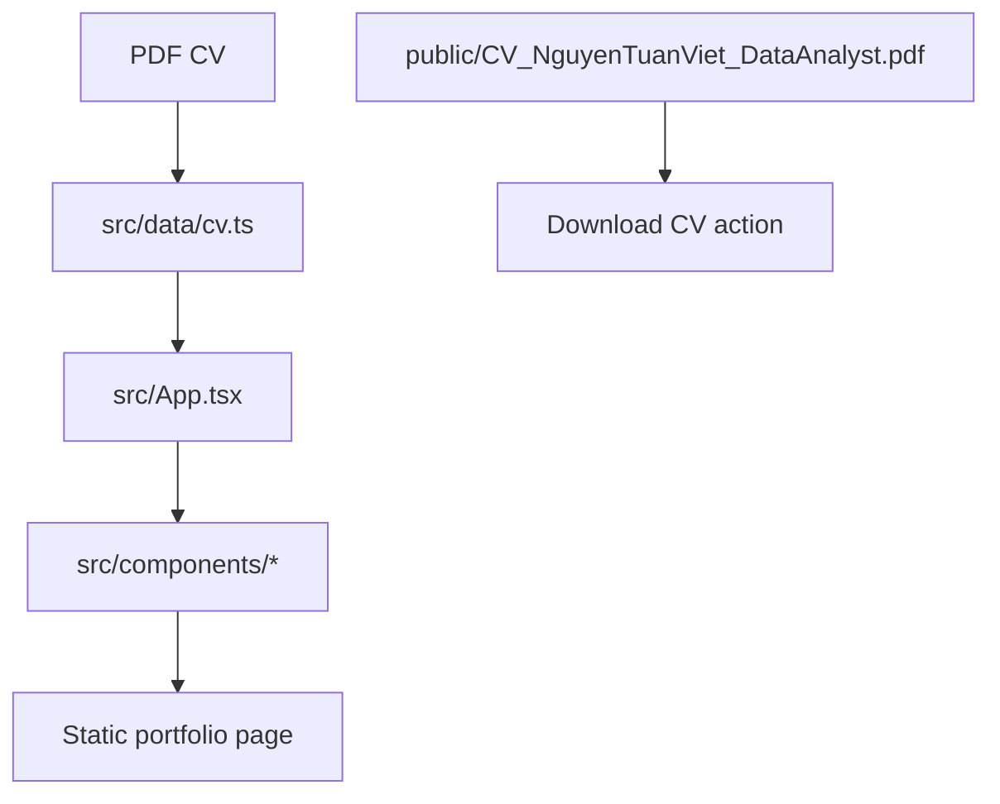

# System Architecture

## Runtime

- Browser loads Vite-built static assets.
- React renders one page from local TypeScript data.
- No external runtime API required.

## Deployment Shape

- Build command: `npm run build`.
- Output directory: `dist/`.
- Suitable for static hosting such as Vercel, Netlify, GitHub Pages, Cloudflare Pages, or any static server.

## Open Questions

- None.
